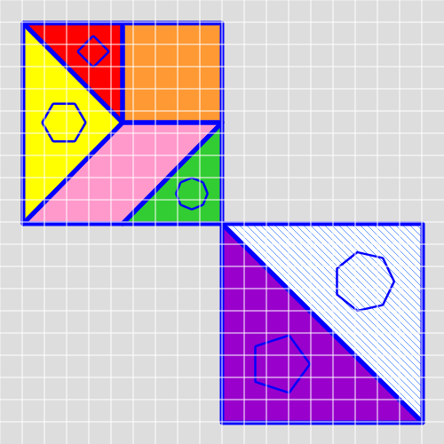
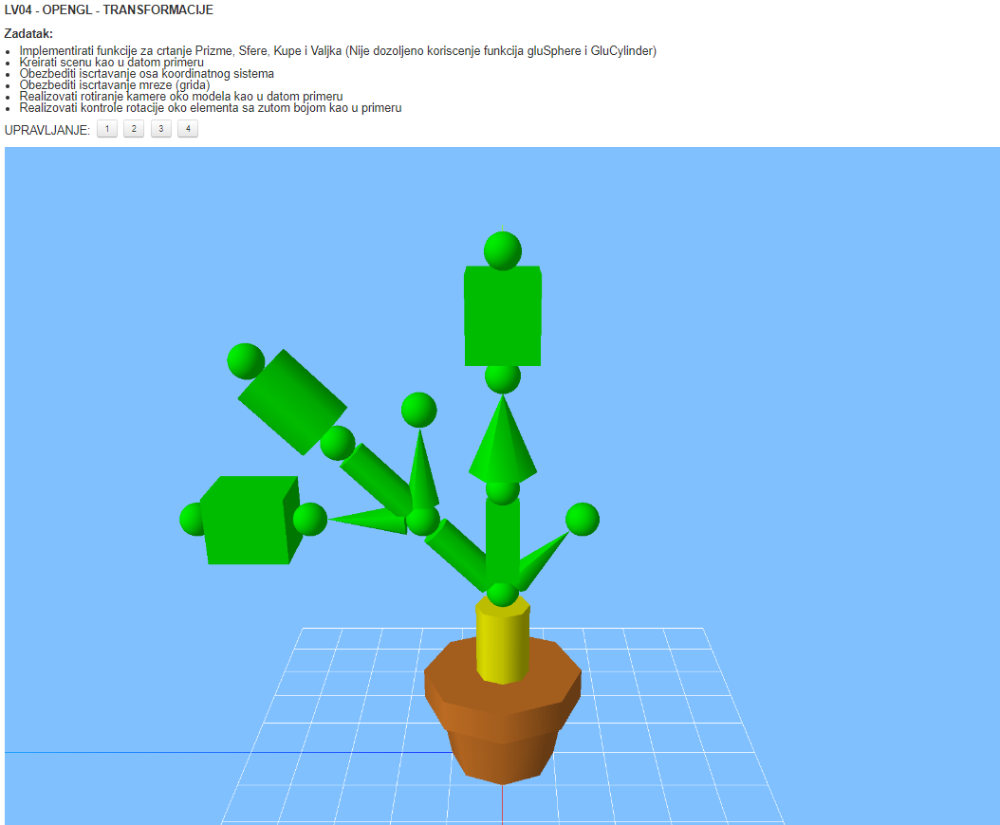

# IVgod(zadaci, primeri, ...)

## Računarska grafika

### Lab

#### LV01 - GDI - TANGRAM - ZADATAK (18.11.2020 - 24.11.2020)

##### Zadatak:

Korišćenjem funkcija GDI-ja potrebno je iscrtati figuru kao na slici (dimenzija 500x500 piksela).
Implementirati fukcionalnost uključivanja/isključivanja iscrtavanja mreže (grid-a) na pritisak tastera po izboru
Za crtanje pravilnih mnogouglova koristiti jednačine: ***x=r\*cos(alfa); y=r\*sin(alfa)***

##### Napomena:

Pojedinačni delovi figure treba da se dodiruju ali ne smeju da se preklapaju
Nije dozvoljeno korišćenje funkcije FloodFill za ispunu unutrašnjosti pojedinačnih delova figure

#### LV02 - GDI - TRANSFORMACIJE - ZADATAK (28.11.2020 - 03.12.2020)

#### LV03 - GDI - BITMAPE - MONAPUZZLE - ZADATAK (05.12.2020 - 12.12.2020)

#### LV04 - OPENGL - TRANSFORMACIJE

## Zaštita informacija

### Domaći

#### Zad A1, B1

ARC4, f-je za kriptovanje, dekriptovanje, upis i čitanje iz fajla

#### Zad A2, B2

Bifid, f-je za kriptovanje, dekriptovanje, 
upis i čitanje iz .bmp fajla

#### Zad A3, B3

RSA, f-je za kriptovanje, dekriptovanje, 
CRC za proveru validnosti, 
optimalnije čitanje iz fajla (fajlovi 100MB, kriptuju se blokovi)

## Programski prevodioci

### Lab

#### Zad1

**Grupa 6**

Kreirati **jflex** specifikaciju za generisanje leksičkog analizatora domenski-specifičnog jezika iz oblasti
upravljanja računarskim infrastrukturama koji je definisan datom gramatikom. **Task** je apstrakcija
zadatka koji obavlja neki **Server**, a **Mapping** je alokacija zadatka serveru. **Demand** izražava zahteve
zadatka za resursima, a **Capacity** izražava mogućnost servera da izvršava zadatke (koji imaju manji ili
jednak **Demand**).  

Model → **model** Body **~model**  
Body → Declarations Statements Deployment  
Declarations → VariableDeclaration  
VariableDeclaration → VariableDeclaration **;** Variable | Variable  
Variable → **ID** ∶ Type **;**  
Type → **int** | **double** | **string**  
Statements → Statements **;** Statement | Statement  
Statement → Assignment | WhileStatement  
WhileStatement → **while** **(** RelExpression **)** **:** Statements  
RelExpression → Term RelOp Term | Term  
Term → **ID** | **CONST**  
RelOp → **less** | **equal** | **greater**  
Assignment → **ID** ∶= Expression  
Deployment → **deployment** TaskList ServerList **~deployment**  
ServerList → ServerList **;** ServerDef | ServerDef  
ServerDef → **server** ServerName **,** Capacity **~server**  
ServerName → **serverId ID**  
Capacity → Term  
TaskList → TaskList **;** TaskDef | TaskDef  
TaskDef → **task** TaskName **,** Demand **,** Mapping **~task**  
TaskName → **taskId ID**  
Demand → Term  
Mapping → **executedOn ID**  
Expression → Expression **+** Term | Expression **\*** Term | Term  

Terminalni simbol **ID** u ovom programskom jeziku označava identifikator (niz velikih slova i cifara u
kojem prvi znak ne može da bude cifra), a konstante mogu biti:  
\4. Konstante tipa **int**:  
<niz_cifara>  
\5. Konstante tipa **double**:  
\[−]<niz_cifara>.<niz_cifara>  
\6. Konstante tipa **string**:  
''<niz_znakova>''  
Komentari u ovom programskom jeziku počinju simbolom **comm** i završavaju se simbolom
**~comm**

## Veštačka inteligencija

### Lab

#### Pripema1 (Examples/lab1/EasyFunctionsLab1Examples)

#### Pripema2 (Examples/lab2/Lab2Examples)

#### Termin1

Napisati funkciju koja svaki od prvih n elemenata liste atoma uvećava za 1, a preostale umanjuje za \1. Zadatak realizovati u okviru jedne funkcije.

Zaglavlje funkcije: (**promeni** n lista)

Primeri poziva: (**promeni** *’4 ’(5 8 3 8 1 8 6 7 9)*) => *(6 9 4 9 0 7 5 6 8)*

#### Termin2

Definisati funkcije:

a. list_oduzimanje, za oduzimanje elemenata 2 liste, tako da se od prvog elementa prve liste oduzima poslednji element druge liste i tako redom.

(**list_oduzimanje** *'(4 5 6) '(1 2 3)*) -> *(1 3 5)*

b. min, koja pronalazi najmanji element prave liste.

(**min** *'(3 6 1 8 9)*) -> *1*

(**min** *'(((5 6) 9) 3 6 4 (7 1))*) -> *1*

Zadatke je potrebno rešiti rekurzijom. Svaki zadatak realizovati u okviru jedne funkcije.