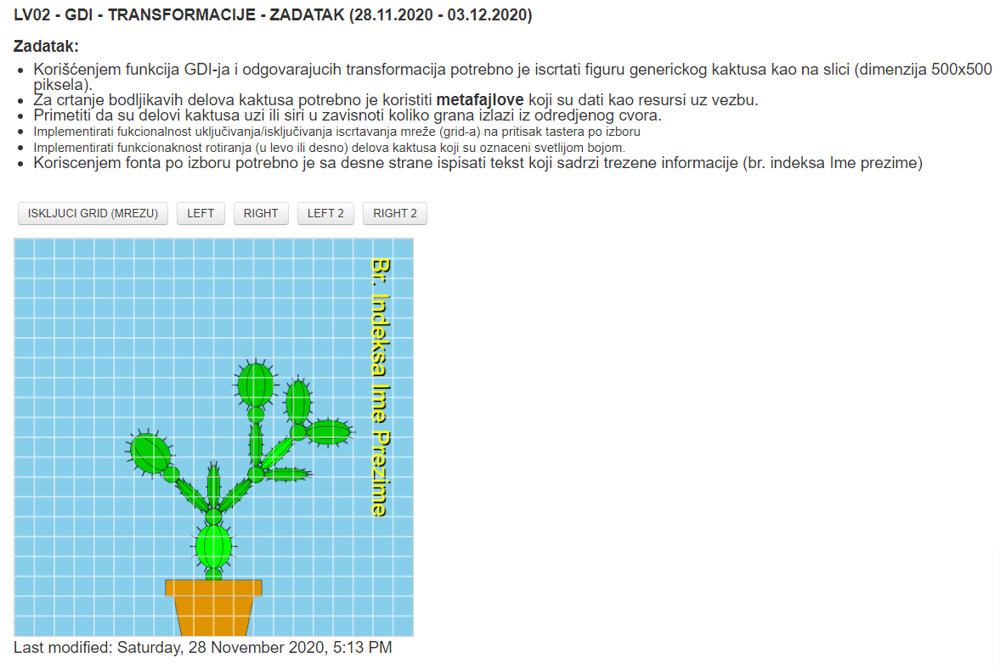

# IVgod(zadaci, primeri, ...)

## Računarska grafika

### Domaći

#### Termin 1

#### Termin 2

### Lab

#### LV01 - GDI - TANGRAM - ZADATAK (18.11.2020 - 24.11.2020)

##### Zadatak:

Korišćenjem funkcija GDI-ja potrebno je iscrtati figuru kao na slici (dimenzija 500x500 piksela).
Implementirati fukcionalnost uključivanja/isključivanja iscrtavanja mreže (grid-a) na pritisak tastera po izboru
Za crtanje pravilnih mnogouglova koristiti jednačine: x=r*cos(alfa); y=r*sin(alfa)

##### Napomena:

Pojedinačni delovi figure treba da se dodiruju ali ne smeju da se preklapaju
Nije dozvoljeno korišćenje funkcije FloodFill za ispunu unutrašnjosti pojedinačnih delova figure

#### LV02 - GDI - TRANSFORMACIJE - ZADATAK (28.11.2020 - 03.12.2020)

## Zaštita informacija

### Domaći

#### Zad A1, B1

ARC4, f-je za kriptovanje, dekriptovanje, upis i čitanje iz fajla

#### Zad A2, B2

Bifid, f-je za kriptovanje, dekriptovanje, upis i čitanje iz .bmp fajla

## Programski prevodioci

### Lab

#### Zad1

##### Grupa 6

Kreirati jflex specifikaciju za generisanje leksičkog analizatora domenski-specifičnog jezika iz oblasti
upravljanja računarskim infrastrukturama koji je definisan datom gramatikom. Task je apstrakcija
zadatka koji obavlja neki Server, a Mapping je alokacija zadatka serveru. Demand izražava zahteve
zadatka za resursima, a Capacity izražava mogućnost servera da izvršava zadatke (koji imaju manji ili
jednak Demand).
Model → model Body ~model
Body → Declarations Statements Deployment
Declarations → VariableDeclaration
VariableDeclaration → VariableDeclaration ; Variable | Variable
Variable → ID ∶ Type ;
Type → int | double | string
Statements → Statements ; Statement | Statement
Statement → Assignment | WhileStatement
WhileStatement → while ( RelExpression ) : Statements
RelExpression → Term RelOp Term | Term
Term → ID | CONST
RelOp → less | equal | greater
Assignment → ID ∶= Expression
Deployment → deployment TaskList ServerList ~deployment
ServerList → ServerList ; ServerDef | ServerDef
ServerDef → server ServerName , Capacity ~server
ServerName → serverId ID
Capacity → Term
TaskList → TaskList ; TaskDef | TaskDef
TaskDef → task TaskName , Demand , Mapping ~task
TaskName → taskId ID
Demand → Term
Mapping → executedOn ID
Expression → Expression + Term | Expression * Term | Term
Elektronski fakultet u Nišu
KATEDRA ZA RAČUNARSTVO
Programski prevodioci
Laboratorijska vežba 1.
Terminalni simbol ID u ovom programskom jeziku označava identifikator (niz velikih slova i cifara u
kojem prvi znak ne može da bude cifra), a konstante mogu biti:
4. Konstante tipa int:
<niz_cifara>
5. Konstante tipa double:
[−]<niz_cifara>.<niz_cifara>
6. Konstante tipa string:
''<niz_znakova>''
Komentari u ovom programskom jeziku počinju simbolom comm i završavaju se simbolom
~comm